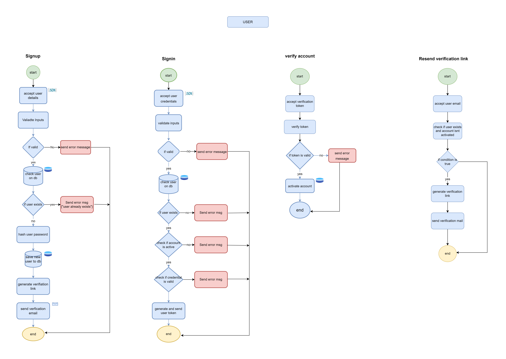

# ParkiT

## Introduction 

This is a parking lot management system that allows users to reserve parking space in nearby parking lots and pay upon checkout. The system also provides analytics of the parking lot usage.

## Features

- **Account:** Users can create an account, verify sign up and sign in.
- **Authorization:** User authorization system with JWT-based token
- **Reservation:** Users can view the available parking spaces and reserve a space.
- **Garage:** Users can view nearby parking lots
- **Payment:** Integration with Stripe API for secure payments processing.
- **Analytics:**  Analytics and insights into parking usage, trends and patterns using Elasticsearch and Kibana.   
- **Directions:** Real-time location tracking on the frontend using Google Maps and Location API to help users find reserved parking spaces easily.

## Technologies Used

- Node.js
- Express.js
- MongoDB
- Elasticsearch & Kibana
- Stripe API

## API Endpoints

- **POST '/user/signin':** create new user account
- **POST '/user/signup':** log in to an existing user account
- **POST '/user/verify-mail':** verify user account/email after sign-up
- **POST '/user/reverify-mail':** resend verification email to user
- **GET '/garage':** get a list of all parking lots
- **GET '/garage/nearby':** get the most nearest parkin lot
- **GET '/garage/nearby/spaces':** fetch all available parking spaces in a parking lot
- **POST '/reservation/reserve':** reserve a space
- **POST '/reservation/check-in':** check into a reserved space
- **POST '/reservation/check-out':** calculate bill and checkout
- **POST '/reservation/exit':** open locks to exit reserved space
- **POST '/payments/pay':** pay space usage bill

# Workflow

### User

### Reservation

